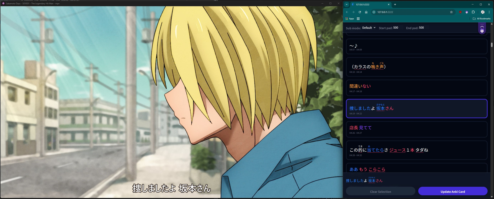

# Migaku MPV

An add-on script for the [mpv](https://mpv.io/) video player to learn languages in conjunction together with the Migaku
browser extension.



# Installation

Install the latest mpv version ([Downloads](https://mpv.io/installation/)).

Start it at least once to create the configuration folders.

[Download](https://github.com/migaku-official/migaku-mpv/releases/latest) the latest release of Migaku MPV for your
operating system under releases.

mpv folder is:

- On Linux and macOS it is located at `~/.config/mpv`.
- On Windows it is located at `%appdata%/mpv`.

If it doesn't exist yet, create the `scripts` folder and the `scripts-opts` folder inside the `mpv` folder.

Extract the `migaku_mpv` folder from the downloaded archive into the `scripts` folder of mpv.

Create the `mpv/scripts-opts/migaku_mpv.conf` (example file):

```
# Proportion of the video from the top that shows the secondary
# subtitles when hovered.
# Possible values: 0.0 to 1.0
secondary_sub_area=0.25

# Language of secondary subs that should be automatically loaded
# Accepts the same values as slang in mpv.conf
secondary_sub_lang=eng,en

# Enable developer mode to see debug messages in the terminal
dev_mode=no
```

# Usage

Open any media file and select the primary and secondary subtitles you want to use. Press `b` to open the subtitle
browser.

# Build instructions

Requires Python 3.13 or later and [Bun](https://bun.sh/) 1.2.5.

Frontend needs to be built at least once, so the `index.html` gets created:

```bash
cd frontend
bun install
bun run build
```

If you want to turn the backend into a binary to avoid requiring Python on the target system, you can
use [PyInstaller](https://www.pyinstaller.org/):

```bash
pip install pyinstaller
pyinstaller --onefile backend/migaku_mpv.py
```

# Development

Use virtual environments for Python dependencies:

```bash
py -m venv .venv
py -m pip install -r requirements.txt
```

Use `dev_mode=yes` in both `mpv/scripts-opts/migaku_mpv.conf` and `mpv/scripts/migaku_mpv/migaku_mpv.ini` to enable
debug messages and to
manually start the python backend:

```bash
.venv\Scripts\python .\backend\migaku_mpv.py /tmp/mpv-ipc-handle-1755906001
````

No watch mode in the frontend, so you have to rebuild manually after changes:

```bash
cd frontend
bun run build
```

# License

GNU General Public License v3 (See [COPYING](./COPYING))